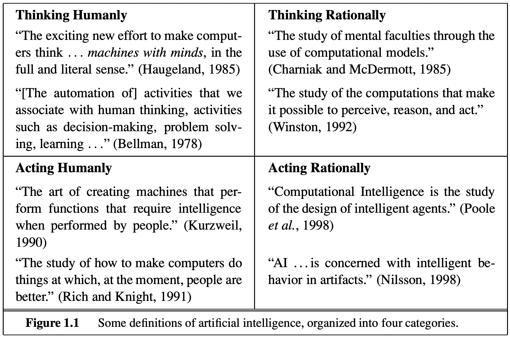

# Artificial General Intelligence and GATO Review

## Introduction to AGI

Artificial General Intelligence has long been studied. The term "general" is coined as many different ways but they all share common properties - act & perform like human in many perspectives. Their definition and role have been discussed for long time and well organized in the attached figure. This system is required to work autnomous, goal-directed and adaptive [1]. The early general intelligence was aimed to achieve this with deductive reasoning [2]. Under well designed, controlled and defined circumstances like chess (Deep Blue), it was nearly possible to make a system that works. However, our real world is not that easy and is full of exceptions. Thanks to advent of parallel computing, neural networks who make inductive decision were able to be trained. Yet due to their limited tasks based on their training dataset, it is hard to expect an ideal artificial intelligence in these days. Struggles to make this work in neuroscience and computer hardware literature are wild [3, 4].

## Summary

This paper aimed to come up with a general sequential model on multiple tasks, training models with multiple datasets from various domians. They encode all datasets including vision, language and control environment datasets. Experiments including their model scalability and ablation studies were explained. Yet, their quantiative performance compared to related works or why their model is performing well was not clearly explained.

## Strengths

+ Suggested approach is not novel but strong. It was dare to train on multiple domains/tasks at once, hurting performance for all domains.
+ For credibility in their generalization result, train-testing with multiple combinations of datasets were nicely done. Comparing their results with specialist model was also a good idea.

## Weaknesses

+ Though comparison is not always the best, it would have been better to compare their results on other benchmark datasets for richer insights.
+ Vision and language results were insufficiently discussed, rather focusing on robotic results. They are not even quantiative but rather qualitative as well. Especially the language results, regarding that gaming datasets being subset of imagery datasets, their largest model which scales up to 1.18B parameters maybe sufficient. However, with recent works announcing that the performance upper bounds constrained by model size and datset size [5, 6], they should have used 20B tokens to fully train them.
+ As languages are also learned in autoregressive way, the model will likely lack understanding of context. However, this will be beneficial to control environment datasets, which happens autoregressively in human world as well.
+ WHy such training scheme is working was not revealed, experiments on this were not conducted nor any sense that this works. The model was trained with multiple domains who does not share any, unknown buy possibly, connections between and shares all parameters. This should be compared with their models trained on single domain.

## Scoring: Weak Reject

+ Though their vision and language works are not discussed in satisfactory, generalizability on unseen tasks and ablation on these were nicely done. However, their result is non-comparable to preceding works and why their models work was not described in the paper. 

## Discussion

+ In AGI perspective, this paper lacks the core requirements - autonomous and adaptiveness. Also their listed related works are generalist models that can 'do' multiple tasks, but not aligned with the original virtue of AGI. This single transformer can perform multiple tasks but naively completing the task does not make this model AGI. However, transformer models are just doing the designated task and to me, this inductive reasoning models seem to have hard limitations becoming an AGI. There should be a novel way to come up with AGI.
+ However, I believe they will later attach additional experiment results on different domains since they named it A "Generalist" Agent. Vision and language works listed are way too weak and they even missed few-shot tasks on language which is the beauty of an autoregressive model.
+ Can we achieve a true AGI with a single neural network as they proposed? I think there is no problem with models doing a single to few tasks with same weights, but it is the problem of making a model that can autonomously choose which models to use, in certain environments. This does not need to cover all the tasks and actions that humans can do, but only the cognition task without robotics will be a nice start. In this view point, GPT-3s' few-shot task shines in that they can give query a model with unlabeled questions where model needs to find the task in that given query.
+ During this report, therer were many papers that claim/put "artificial general intelligence" and they are mostly outside the computer science realm. 
+ [Alexa... laughs...](https://www.youtube.com/watch?v=p8phGxzUC_Y)

***
## Reference

[1] Goertzel, Ben. **Artificial general intelligence**. Ed. Cassio Pennachin. Vol. 2. New York: Springer, 2007.

[2] Everitt, Tom. **Towards safe artificial general intelligence**. Diss. The Australian National University (Australia), 2019.

[3] Pei, Jing, et al. **"Towards artificial general intelligence with hybrid Tianjic chip architecture."** Nature 572.7767 (2019): 106-111.

[4] Yamakawa, Hiroshi. **"The whole brain architecture approach: Accelerating the development of artificial general intelligence by referring to the brain."** Neural Networks 144 (2021): 478-495.

[5] Kaplan, Jared, et al. "**Scaling laws for neural language models.**" arXiv preprint arXiv:2001.08361 (2020).

[6] Hoffmann, Jordan, et al. "**Training Compute-Optimal Large Language Models.**" arXiv preprint arXiv:2203.15556 (2022).

## Some quotes

> *(Goertzel, et al., [1])*More specifically, this learning ability needs to be autnomous, goal-directed and highly adadptive: 
>> **Autonomous**. Learning occurs both automatically, through exposure to sense data (unsupervised), and through bi-directional interaction with the environment, including exploration and experimentation (self-supervised).   
>> **Goal-directed**. Learning is directed (autonomously) towards achieving varying and novel goals and sub-goals – be they “hard-wired,” externally specified, or self-generated. Goal-directedness also implies very selective learning and data acquisition (from a massively data-rich, noisy, complex environment).   
>> **Adaptive**. Learning is cumulative, integrative, contextual and adjusts to changing goals and environments. General adaptivity not only copes with gradual changes, but also seeds and facilitates the acquisition of totally novel abilities.

> (Everitt et al., [2]) ...  The primary focus of AI is on acting rather than thinking, and on doing the right thing rather than emulating humans.

> *(Anand Ramaamoorthy et al, 2018)* ... Strong AI, that is, an artificial intelligence that is truly general and not constrained to a task-domain. 

> *(Jing Pei et al., 2019, [3])* Given current progress in machine learning and neuroscience, an AGI system should have at least the following features: first, support for vast and complex neural networks that can represent rich spatial, temporal and spatiotemporal relationships; second, support for hierarchical, multigranular and multidomain network topologies, but without being limited to a specialized network structure; third, support for a wide range of models, algorithms and coding schemes; and fourth, support for the intertwined cooperation of multiple specialized neural networks that are designed for different tasks in parallel processing.